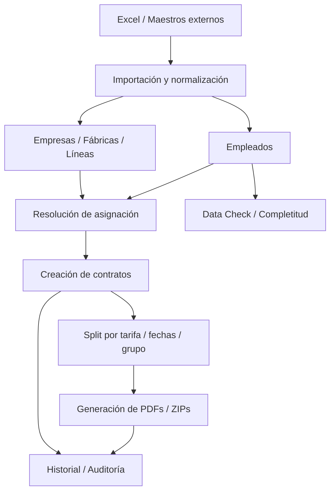

# Architecture — JP個別契約書 v26.3.25

## 1. Propósito del sistema

JP個別契約書 es un sistema interno para **UNS (ユニバーサル企画株式会社)** que administra el ciclo operativo de dispatch:

1. maestros de empresas/fábricas/líneas
2. importación y asignación de empleados
3. creación de contratos individuales o por lote
4. generación de documentos legales
5. trazabilidad, auditoría y mantenimiento operativo

No es solamente un generador de PDFs.  
Es un sistema de negocio centrado en la consistencia entre:

- asignación real
- tarifa efectiva
- contrato emitido
- documentación legal resultante

---

## 2. Mapa general



---

## 3. Capas de arquitectura

## Backend

Base:

- `server/index.ts`

Responsabilidades:

- levantar Hono
- registrar rutas
- exponer health/backup
- aplicar CORS
- aplicar límite de body
- aplicar guardia de seguridad en endpoints mutantes

## Persistencia

- `server/db/index.ts`
- `server/db/schema.ts`

Características:

- SQLite local
- modo WAL
- foreign keys habilitadas
- `busy_timeout`
- pequeño parche de compatibilidad sobre `audit_log.operation_id`

## Capa de rutas

`server/routes/*`

Responsabilidades:

- parsear requests
- validar input
- componer queries/transactions
- devolver shape HTTP

## Capa de servicios

`server/services/*`

Responsabilidades:

- lógica de negocio reusable
- normalización
- cálculo
- resolución de asignaciones
- armado de payloads PDF

## Capa documental/PDF

`server/pdf/*`

Responsabilidades:

- layout legal
- render de PDFKit
- variantes estándar vs コーリツ

## Frontend

Base:

- `src/main.tsx`
- `src/routes/__root.tsx`

Responsabilidades:

- navegación
- query state
- wizard state persistido
- paneles de operación
- generación documental

---

## 4. Modelo del dominio

La cadena principal del negocio es:

```text
empresa → fábrica → departamento → línea → empleados → contratos → documentos
```

### Entidades principales

- `client_companies`
- `factories`
- `employees`
- `contracts`
- `contract_employees`
- `factory_calendars`
- `shift_templates`
- `audit_log`

### Observación importante

La unidad operativa más importante no es la empresa, sino la **línea**.

Sobre cada línea viven:

- supervisor / 指揮命令者
- 派遣先責任者
- complaint handlers
- manager UNS
- horarios
- break
- overtime
- conflict date
- contract period
- rate base

Si una línea queda mal configurada, el impacto se arrastra a:

- selección de empleados
- cálculo contractual
- PDF legal
- historial

---

## 5. Workflows principales

## 5.1 Maestro de empresas / fábricas / líneas

### Archivos

- `src/routes/companies/index.tsx`
- `src/routes/companies/table.tsx`
- `server/routes/companies.ts`
- `server/routes/factories.ts`

### Qué hace

- muestra registry de empresas
- permite paneles por empresa
- administra líneas y datos legales
- permite edición masiva de calendarios/roles

### Por qué existe

Porque el contrato no se puede emitir sin una línea correctamente configurada.

---

## 5.2 Importación de empleados

### Archivos

- `src/routes/import/index.tsx`
- `server/routes/import.ts`
- `server/services/dispatch-mapping.ts`
- `server/services/import-assignment.ts`
- `server/services/import-utils.ts`

### Pipeline

1. frontend carga workbook
2. transforma a JSON
3. backend normaliza headers
4. resuelve empresa vía dispatch mapping
5. resuelve línea/factory
6. parsea fechas Excel
7. parsea rates
8. hace upsert/skip
9. audita

### Regla crítica

No hay que inventar asignaciones ambiguas.  
`factoryId` debe salir de datos suficientemente explícitos.

---

## 5.3 Importación de factories

### Archivos

- `server/routes/import-factories.ts`

### Qué hace

- importa líneas desde workbook
- detecta inserts/updates
- actualiza responsables, horarios, datos legales y operativos

### Matching

- estricto: `companyId + factoryName + department + lineName`
- relajado: ignora `department` en algunos casos

---

## 5.4 Workflow コーリツ

### Archivos

- `src/routes/companies/koritsu.tsx`
- `server/routes/import-koritsu.ts`
- `server/services/koritsu-excel-parser.ts`

### Qué hace

- parsea workbook específico
- compara contra DB
- presenta diff
- aplica cambios sobre factories

### Significado arquitectónico

El sistema ya soporta **customización por cliente**.

---

## 5.5 Data Check

### Archivos

- `src/routes/data-check/index.tsx`
- `server/routes/data-check.ts`
- `server/services/completeness.ts`

### Qué hace

- calcula completitud por empleado/línea
- clasifica visualmente
- exporta workbook de corrección
- reimporta cambios

### Valor

Convierte calidad de datos en un workflow operativo concreto.

---

## 5.6 Contrato individual

### Archivos

- `src/stores/contract-form.ts`
- `src/components/contract/*`
- `src/routes/contracts/new.tsx`
- `server/routes/contracts.ts`

### Etapas

1. selección de empresa/fábrica/depto/línea
2. cálculo de fechas
3. autofill legal/operativo
4. cálculo de rates
5. selección de empleados

### Estado local

Se persiste draft del wizard en Zustand.

### Comportamientos adicionales del wizard

- **Draft recovery**: al entrar al wizard, detecta si existe un borrador de una sesión previa y muestra un banner para descartarlo o continuarlo (`contract-form.ts`)
- **ContractPreview**: panel de vista previa en vivo, visible a partir del step 2
- **Toggle de empleados retirados**: permite incluir empleados inactivos/anteriores para contratos retroactivos

### Nota sobre naming en schema

La columna `contracts.hourlyRate` almacena en la práctica el valor de **billingRate** (単価), no el 時給 del trabajador. El wizard pasa `billingRate ?? hourlyRate ?? factory.hourlyRate` a este campo. El nombre es legacy pero funcionalmente consistente en todo el codebase.

---

## 5.7 Split por tarifa

### Idea

Si una misma línea tiene empleados con distinta tarifa efectiva, el sistema los separa en grupos y arma contratos distintos.

### Razón

Evita mezclar condiciones económicas incompatibles en el mismo documento.

### Impacta

- wizard individual
- batch
- documents
- contract_employees

---

## 5.8 Batch contracts

### Archivos

- `src/routes/contracts/batch.tsx`
- `server/routes/contracts-batch.ts`

### Subflujos

- preview
- create

### Qué analiza

- empleados activos por línea
- grupos por rate
- duplicados
- endDate efectiva
- cap por conflict date
- participation
- exenciones

---

## 5.9 New hires

### Archivos

- `src/routes/contracts/new-hires.tsx`
- `server/routes/contracts-batch.ts`

### Qué hace

- detecta empleados por rango de hire date
- agrupa por línea/rate
- permite excluir casos
- crea contratos con startDate individual o earliest hire

---

## 5.10 Generación documental

### Archivos

- `server/routes/documents.ts`
- `server/routes/documents-generate.ts`
- `server/services/document-generation.ts`
- `server/services/pdf-data-builders.ts`
- `src/routes/documents/index.tsx`

### Salidas

- 個別契約書
- 通知書
- 派遣先管理台帳
- 派遣元管理台帳
- 労働契約書
- 就業条件明示書
- ZIPs

### Branching especial

#### Standard branch

Usa:

- `kobetsu-pdf.ts`
- `tsuchisho-pdf.ts`
- `hakensakikanridaicho-pdf.ts`
- `hakenmotokanridaicho-pdf.ts`

#### コーリツ branch

Usa:

- `koritsu-kobetsu-pdf.ts`
- `koritsu-tsuchisho-pdf.ts`
- `koritsu-hakensakidaicho-pdf.ts`

---

## 5.11 Historial y auditoría

### Archivos

- `src/routes/history/index.tsx`
- `src/routes/audit/index.tsx`
- `server/routes/dashboard.ts`

### Qué resuelve

- agrupación de contratos emitidos
- historial de labor docs
- regeneración de ZIP
- exploración del audit log

### Restricción de integridad en empleados

No existe endpoint DELETE para empleados — solo se pueden crear y actualizar. Es intencional para preservar integridad de datos y continuidad del audit trail.

---

## 5.12 Settings / operación

### Archivos

- `src/routes/settings/index.tsx`
- `server/services/backup.ts`

### Qué incluye

- backup DB
- bulk update de calendarios
- system info

### Detalles operativos

- Los archivos de backup se acumulan en `data/` sin rotación ni limpieza automática. Requiere limpieza manual periódica.
- El parámetro `warningDays` del dashboard (no `conflictWarningDays`) controla la ventana de contratos por vencer. Clamp 1-365, default 30.

---

## 6. Seguridad y operación

### Middleware

- `server/middleware/security.ts`

### Reglas actuales

- solo se protegen mutaciones
- rate limiting por client/path/method

### Implicación

El sistema está diseñado como herramienta interna/admin.

---

## 7. Riesgos arquitectónicos actuales

1. **Dependencia fuerte de Excel externos**
   - si cambian columnas/nombres, se rompe import

2. **Complejidad creciente por cliente**
   - コーリツ ya introdujo una variante vertical fuerte

3. **Acoplamiento documento-negocio**
   - cambios legales u operativos impactan PDFs, builders, rutas y frontend

4. **Credenciales por default en frontend**
   - correcto para interno/dev, débil para exposición externa

---

## 8. Documentación viva del proyecto

| Documento | Propósito |
|---|---|
| `README.md` | onboarding corto |
| `AGENTS.md` | mapa técnico detallado |
| `ESTADO_PROYECTO.md` | historial de sesiones/cambios |
| `docs/architecture.md` | arquitectura funcional y flujos |
| `docs/documentation-changelog.md` | mantenimiento documental |

---

## 9. Criterio de mantenimiento

Actualizar esta arquitectura cada vez que cambie alguno de estos ejes:

- schema
- rutas
- workflow batch/new-hires
- importers
- branching documental
- cliente vertical especial
